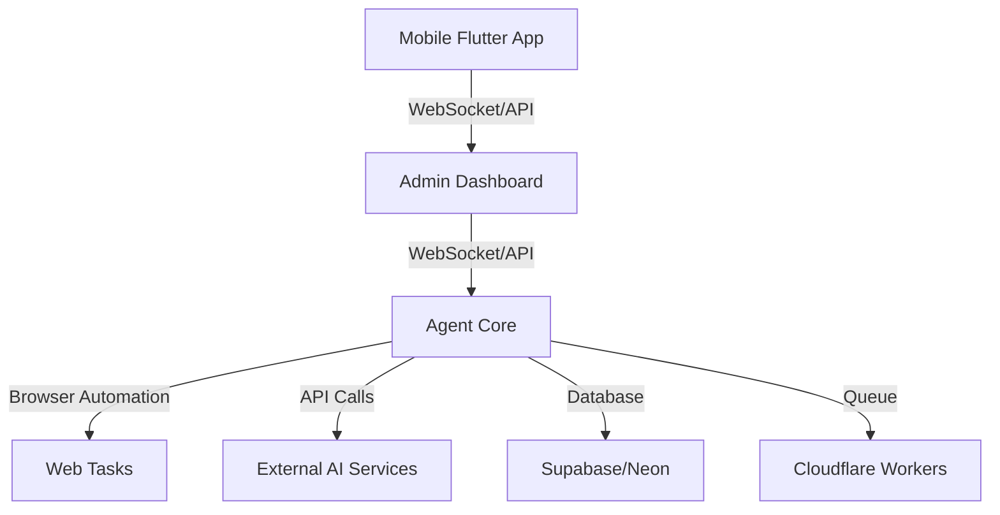

# LiteAgent: AI-Powered Multimodal Automation Agent

A minimal, production-ready AI agent that runs 24/7 in the background to automate web, admin, and mobile tasks for a single user. Built with free-tier services for zero development cost.

<a name="features"></a>

## ✨ Features

- **Multimodal AI**: Leverages external AI APIs (OpenAI, Anthropic, etc.) for vision, text, and reasoning
- **Web Automation**: Browser-based task execution (form filling, data scraping, UI interactions)
- **Admin Dashboard**: Real-time monitoring and control panel
- **Mobile Flutter App**: Cross-platform mobile interface for on-the-go control
- **24/7 Background Operation**: Persistent execution with failover and restart mechanisms
- **Zero-Cost Deployment**: Utilizes free tiers of Cloudflare, Supabase, Vercel, and Neon
- **Privacy-First**: All data remains user-controlled with optional self-hosting
- **Extensible Plugin System**: Add new capabilities via simple Python modules

## 📚 Table of Contents

- [Features](#features)
- [Architecture](#architecture)
- [Technology Stack](#technology-stack)
- [Prerequisites](#prerequisites)
- [Installation & Setup](#installation-setup)
- [Deployment (Zero Cost)](#deployment-zero-cost)
- [Usage Examples](#usage-examples)
- [Security & Privacy](#security-privacy)
- [Performance & Reliability](#performance-reliability)
- [Roadmap](#roadmap)
- [Contributing](#contributing)
- [License](#license)
- [Acknowledgments](#acknowledgments)
- [Contact](#contact)

<a name="architecture"></a>

## 🏗️ Architecture

LiteAgent follows a modular, loosely-coupled architecture designed for extensibility and ease of deployment. The system consists of four primary components that communicate via WebSockets and REST APIs:



**Component Responsibilities:**

- **Mobile Flutter App**: Provides a cross-platform interface for monitoring and controlling the agent on-the-go. Communicates with the Admin Dashboard and Agent Core via secure WebSockets.
- **Admin Dashboard**: A real-time web-based control panel built with Next.js for managing tasks, viewing logs, and configuring the agent. Acts as the primary user interface.
- **Agent Core**: The heart of LiteAgent, responsible for orchestrating tasks, managing the execution flow, and integrating with external services. Implements the automation logic and AI interactions.
- **Web Tasks**: The actual browser automation performed by Playwright, controlled by the Agent Core to interact with websites.
- **External AI Services**: APIs from providers like OpenAI and Anthropic that provide multimodal AI capabilities for vision, text, and reasoning.
- **Database**: Persistent storage for task configurations, logs, user preferences, and agent state, using either Supabase or Neon (PostgreSQL-compatible).
- **Cloudflare Workers**: Serverless functions that handle real-time communication (WebSockets) and background job queuing for scalable, low-latency operations.

**Data Flow:**
1. Users interact with either the Mobile App or Admin Dashboard to create or trigger tasks.
2. The UI components send task requests to the Agent Core via the Admin Dashboard (which acts as a proxy for real-time communication).
3. The Agent Core processes the task, coordinating with the Web Automation module for browser-based actions and External AI Services for intelligent decision-making.
4. Task progress, logs, and results are stored in the Database and communicated back to the UIs in real-time.
5. Cloudflare Workers facilitate real-time updates and handle background processing to ensure the agent remains responsive and efficient.

This architecture ensures separation of concerns, allowing each component to be developed, deployed, and scaled independently while maintaining a cohesive user experience.

<a name="technology-stack"></a>

## 🛠️ Technology Stack

| Component           | Technology                          | Free Tier Provider         |
| ------------------- | ----------------------------------- | -------------------------- |
| **Agent Core**      | Python 3.12+, Playwright, LangChain | Local/VPS (free tier)      |
| **Web Automation**  | Playwright, Selenium                | Local browser              |
| **Admin Dashboard** | Next.js 14, React, TailwindCSS      | Vercel (free)              |
| **Mobile App**      | Flutter 3.22+, Riverpod             | Local build                |
| **Backend API**     | FastAPI, WebSockets                 | Cloudflare Workers (free)  |
| **Database**        | Supabase (PostgreSQL) / Neon        | Supabase/Neon (free)       |
| **Authentication**  | Supabase Auth / NextAuth            | Supabase/Vercel (free)     |
| **Real-time**       | WebSocket (via Cloudflare)          | Cloudflare Workers (free)  |
| **Storage**         | Supabase Storage / Cloudflare R2    | Supabase/Cloudflare (free) |
| **Monitoring**      | Logtail, UptimeRobot                | Free tiers                 |

<a name="prerequisites"></a>

## 📋 Prerequisites

- Python 3.12+
- Node.js 20+
- Flutter SDK 3.22+
- Git
- Accounts for:
  - [Supabase](https://supabase.com) (free tier)
  - [Vercel](https://vercel.com) (free tier)
  - [Cloudflare](https://cloudflare.com) (free tier)
- [Neon](https://neon.tech) (optional, free tier)
  - AI API keys (OpenAI, Anthropic, etc. - free tiers available)

<a name="installation-setup"></a>

## 🔧 Installation & Setup

### 1. Clone Repository

```bash
git clone https://github.com/johnnykhloudhost/LiteAgent.git
cd liteagent
```

### 2. Configure Environment

Copy `.env.example` to `.env` and fill in:

```env
# AI Providers
OPENAI_API_KEY=your_openai_key
ANTHROPIC_API_KEY=your_anthropic_key

# Supabase
SUPABASE_URL=your_supabase_url
SUPABASE_ANON_KEY=your_supabase_anon_key
SUPABASE_SERVICE_ROLE_KEY=your_supabase_service_key

# Cloudflare
CLOUDFLARE_ACCOUNT_ID=your_account_id
CLOUDFLARE_WORKERS_TOKEN=your_workers_token

# NextAuth (for Vercel)
NEXTAUTH_SECRET=your_nextauth_secret
NEXTAUTH_URL=https://your-domain.vercel.app

# Flask/FastAPI
SECRET_KEY=your_secret_key
```

### 3. Install Dependencies

```bash
# Backend (Python)
pip install -r backend/requirements.txt

# Frontend (Next.js)
cd admin
npm install
cd ..

# Mobile (Flutter)
cd mobile
flutter pub get
cd ..
```

### 4. Initialize Database

```bash
# Run Supabase migrations
npx supabase db push

# Or for Neon
DATABASE_URL=your_neon_url alembic upgrade head
```

### 5. Start Services

```bash
# Start backend agent (background service)
python -m backend.agent.core

# Start API server
python -m backend.api.main

# Start admin dashboard (in another terminal)
cd admin
npm run dev

# Start mobile app (in another terminal)
cd mobile
flutter run -d chrome  # or your device
```

<a name="deployment-zero-cost"></a>

## 🚀 Deployment (Zero Cost)

### Option 1: Self-Hosted (Recommended for Privacy)

1. Deploy backend to a free VPS (Oracle Cloud Free Tier, AWS Free Tier, Google Cloud Free Trial)
2. Use Supabase/Neon for database (free)
3. Use Cloudflare Tunnel for secure web access
4. Run agent as a systemd service

### Option 2: Fully Managed (Vercel + Cloudflare)

1. **Admin Dashboard**: Push to GitHub, connect to Vercel (auto-deploys)
2. **Backend API**: Deploy to Cloudflare Workers (via `wrangler publish`)
3. **Agent Core**: Run on a free-tier VPS or GitHub Actions (scheduled)
4. **Database**: Supabase free tier
5. **Mobile**: Build and distribute via Flutter build (APK/IPA)

#### Deployment Scripts

```bash
# Deploy admin to Vercel
vercel --prod

# Deploy API to Cloudflare Workers
wrangler publish

# Deploy database migrations
npx supabase db push
```

<a name="usage-examples"></a>

## 💡 Usage Examples

### Web Automation

```python
from backend.agent.web import WebAgent

agent = WebAgent()
agent.login("https://example.com", username, password)
agent.fill_form({"field1": "value", "field2": "value2"})
agent.extract_data(".product-price")
agent.screenshot("result.png")
```

### Admin Dashboard Features

- Real-time agent status and logs
- Task scheduling and queue management
- AI model configuration and usage statistics
- Mobile device pairing and control
- Data export and backup tools

### Mobile App Capabilities

- Start/stop agent remotely
- View recent automation results
- Emergency stop and diagnostics
- Push notifications for task completion
- Offline caching of frequent tasks

<a name="security-privacy"></a>

## 🔐 Security & Privacy

- **End-to-End Encryption**: Optional for sensitive data
- **Local-First**: Core agent runs on user's machine
- **Minimal Permissions**: Browser automation uses isolated profiles
- **Audit Logging**: All actions logged for review
- **Data Residency**: Choose where data is stored (Supabase regions)
- **API Key Management**: Keys stored encrypted in database

<a name="performance-reliability"></a>

## 📊 Performance & Reliability

- **Sub-second Response**: WebSocket communication
- **Automatic Retries**: Exponential backoff for failed tasks
- **Resource Monitoring**: CPU/memory usage tracking
- **Failover Mechanisms**: Switches between AI providers
- **Health Checks**: Self-monitoring with restart capabilities
- **Scalability**: Designed for single-user but handles multiple concurrent tasks

<a name="roadmap"></a>

## 🗺️ Roadmap

### Phase 1: Core Automation (Current)

- [x] Web automation with Playwright
- [x] Basic admin dashboard
- [x] Mobile Flutter app skeleton
- [x] Supabase/Neon integration
- [x] Environment variable configuration

### Phase 2: AI Enhancement

- [ ] Multimodal AI integration (vision + reasoning)
- [ ] Custom workflow builder (drag-and-drop)
- [ ] Template library for common tasks
- [ ] Adaptive learning from user corrections

### Phase 3: Mobile & Native Features

- [ ] Mobile-specific automation (Android/iOS APIs)
- [ ] Background services on mobile
- [ ] Voice command integration
- [ ] Biometric authentication

### Phase 4: Ecosystem

- [ ] Plugin marketplace
- [ ] Community template sharing
- [ ] Advanced analytics dashboard
- [ ] Team collaboration features (optional)

<a name="contributing"></a>

## 🤝 Contributing

We welcome contributions! Please see our [Contributing Guide](CONTRIBUTING.md) for details.

1. Fork the repository
2. Create your feature branch (`git checkout -b feature/amazing-feature`)
3. Commit your changes (`git commit -m 'Add amazing feature'`)
4. Push to the branch (`git push origin feature/amazing-feature`)
5. Open a Pull Request

<a name="license"></a>

## 📄 License

This project is licensed under the MIT License - see the [LICENSE](LICENSE) file for details.

<a name="acknowledgments"></a>

## 🙏 Acknowledgments

- [Playwright](https://playwright.dev) for reliable web automation
- [LangChain](https://langchain.com) for AI orchestration
- [Supabase](https://supabase.com) for open-source Firebase alternative
- [Cloudflare Workers](https://workers.cloudflare.com) for serverless functions
- [Flutter](https://flutter.dev) for beautiful cross-platform UIs
- [Vercel](https://vercel.app) for seamless frontend deployment

<a name="contact"></a>

## 📞 Contact

Project Link: [https://github.com/johnnykhloudhost/LiteAgent](https://github.com/johnnykhloudhost/LiteAgent)

---

_Built with ❤️ for developers who want to automate their digital life without infrastructure costs._
